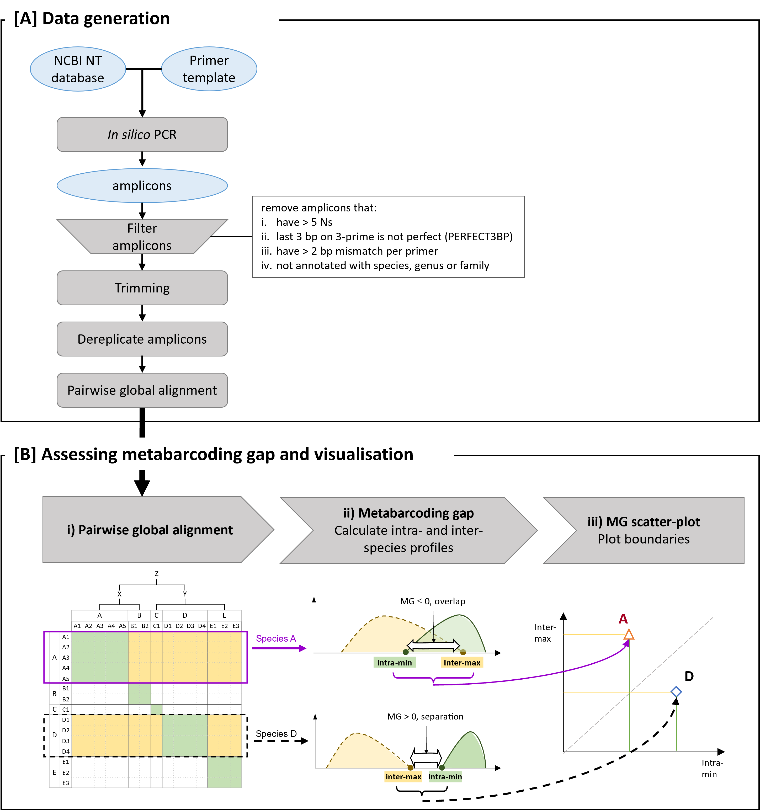

# metabarcode-gap

This repository describes the process used in the paper

Chua et. al. (). Metabarcoding gap visualisation provides easy navigation of taxonomy abnormalities, limitations and comparisons of primer pairs for study design

The workflow is split into data-generation (figure A) and data-processing (figure B) and the process is also split into their respective folders. The method described in the paper is focuses on the visualisation of pairwise alignment data which is the data-processing (figure B) aspect of the workflow. 

While the visualisation is dependent on data, the data generation phase is an independent process. Generation of the data can be very specific to each user/lab/study and therefore we only provide description of one possible method.

