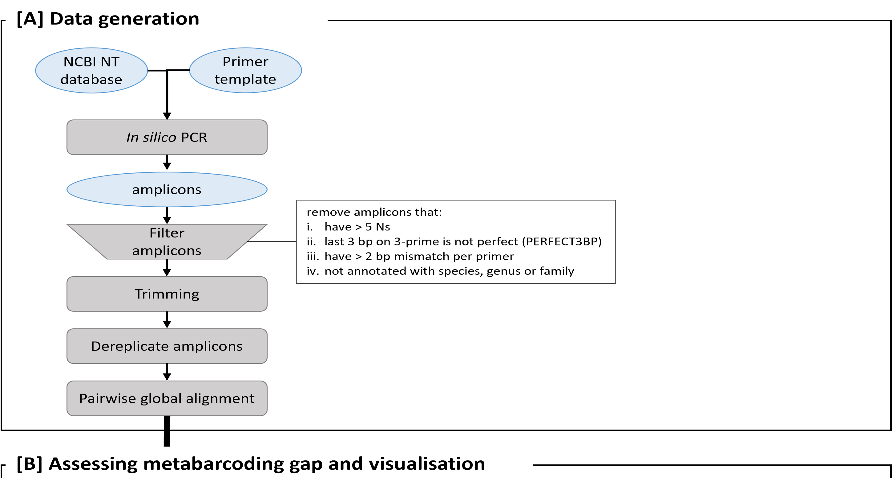

# *in silico* PCR data generation

This guide provides one possible workflow for generating *in silico* PCR amplicon data as input for sequence pairwise alignment. That is Part A of the workflow schema:



- [*in silico* PCR data generation](#in-silico-pcr-data-generation)
- [Step 1 - *in silico* PCR](#step-1---in-silico-pcr)
- [Step 2 - extract amplicon sequence](#step-2---extract-amplicon-sequence)
- [Step 3 - dereplicate amplicon sequences](#step-3---dereplicate-amplicon-sequences)
- [Step 4 - additional filtering amplicons](#step-4---additional-filtering-amplicons)
- [Step 5 - pairwise global alignment](#step-5---pairwise-global-alignment)
- [Finished](#finished)


# Step 1 - *in silico* PCR

**Input**: one or a directory of fasta files

**Output**: a TSV file: `<primer>.hits`

**Tool**: usearch (v11.0.667)

**Commands**:

```bash
joblog=<logfile>
db=<directory_with>/*.fasta
minamp=50
maxdiffs=3

parallel --will-cite --joblog $joblog -j 4 usearch -search_pcr {} -db $primerFile -minamp $minamp -strand both -maxdiffs $maxdiffs -pcrout ${outDir}/{/.}.01.hits ::: ${db}
```

* I had a directory of fasta files, so ran the above using `gnu parallel` and had a list of TSV outputs
* then concatenated the files together and added a header

```bash
partsOut=${outPrefix}_*.01.hits
cat $partsOut > ${outPrefix}.01.hits
sed -i '1iqseqid\tqstart\tqend\tqlen\tp1.name\tp1.strand\tp1.dot\tp2.name\tp2.strand\tp2.dot\tamplen\tamplicon\tp1.diff\tp2.diff\ttotal.diff' ${outPrefix}.01.hits
```


# Step 2 - extract amplicon sequence

**Input**: `<primer>.hits`

**Output**: fasta file with amplicon sequences

**Tool**: custom R script

* During this step, amplicons with > 5 Ns (ambiguous base) was not included in the output
* primers must be convergently oriented

```r
### README ----
#
# This script parses the insilico PCR hit results and extracts the targeted region (amplicon)
# and outputs a fasta file.
#
# The script will ensure to select correctly oriented hits, that is where 
# --- forward primer --->       ...amplicon...        <---- reverse primer ----
#
# The output is written as a fasta file and the amplicons sequences are also saved as an RDS
# data object.
#
```


# Step 3 - dereplicate amplicon sequences

**Input:** amplicon fasta file

**Output:** fasta file of unique sequences

**Tool:** OBITools suite, specifically the following tools

* obicount
* obiannotate
* obiuniq
  
* there are other dereplication tools as well which you can use if you're more familiar with them
* keep track of the number sequences per group after dereplication in the metadata

**Commands:**

* depending on your input file, you might not need the first two steps and can directly skip to below `obiuniq`

```bash
prefix=nt.20190522
dataDir=../ampsTrimmed

echo
echo `date` ":: Remove accession tag"
inFile=${dataDir}/${prefix}.20.fa
sed -i 's/accession=//g' $inFile
obicount $inFile

echo
echo `date` ":: Clean headings"
outFile=${dataDir}/${prefix}.21.tidy
obiannotate --uppercase -C --length -k taxid -k species -T '' $inFile > $outFile
sed -i 's/; taxid/ taxid/g' $outFile
obicount $outFile
```

* dereplicates sequences in a fasta file

```bash
echo
echo `date` ':: Dereplicate sequences by species'
inFile=$outFile
outFile=${dataDir}/${prefix}.30.uniq
obiuniq -c taxid -i $inFile > $outFile
obiannotate --uppercase $outFile > ${dataDir}/tmp
mv ${dataDir}/tmp $outFile
obicount $outFile

echo
echo `date` ':: Convert fasta to uppercase'
inFile=$outFile
outFile=${dataDir}/${prefix}.31.tidy
obiannotate --uppercase -C -T '' --keep='count' $inFile > $outFile

echo
echo `date` ':: Extract metadata'
outFile=${dataDir}/${prefix}.40.tab
grep "^>" $inFile > $outFile
sed -i "s/count/; count/g" $outFile
sed -i "s/; '/'/g" $outFile
sed -i 's/; /\t/g' $outFile
sed -i "s/;', '/','/g" $outFile
sed -i 's/>//g' $outFile
sed -i '1iderepID\tcount\tmerged\ttaxid\tlength' $outFile 
```

# Step 4 - additional filtering amplicons

**Input:** 
- amplicon fasta
- amplicon hit metadata

**Output**: cleaned amplicon files

**Tool:** custom R script to filter the results


* Criteria used for this specific project (you can filter the data based on your own criteria):
  * in step 2 extracting amplicons, we already
    * filtered out amplicons with > 5 Ns and also
    * primers must be convergently oriented
  * minimum perfect matches on 3prime end of the priming region (default=3bp)
  * maximum number of mismatches per primer (default=2bp)
  * removed amplicons with lengths < 10% of the distribution (i.e. too short)
  * check orientation of the sequence, only accept sequences in positive strand orientation

# Step 5 - pairwise global alignment

**Input:** cleaned amplicon files

**Output:** table of pairwise alignments results

**Tool:** vsearch (v2.13.4)

**Commands:**

```bash
inFile=<path/to/input_file>
outFile=<path/to/output_file>

vsearch -allpairs_global $inFile -acceptall --userout $outFile --userfields query+target+id+alnlen+mism+opens+qlo+qhi+tlo+thi+evalue+bits+ids
sed -i '1iquery\ttarget\tpident\taln_len\tmismatch\tgaps\tqstart\tqend\ttstart\ttend\tevalue\tbit_score\tidentities' $outFile
```


---

# Finished

After this, the pairwise alignments and metadata are used as input for investigating the metabarcoding gaps.
