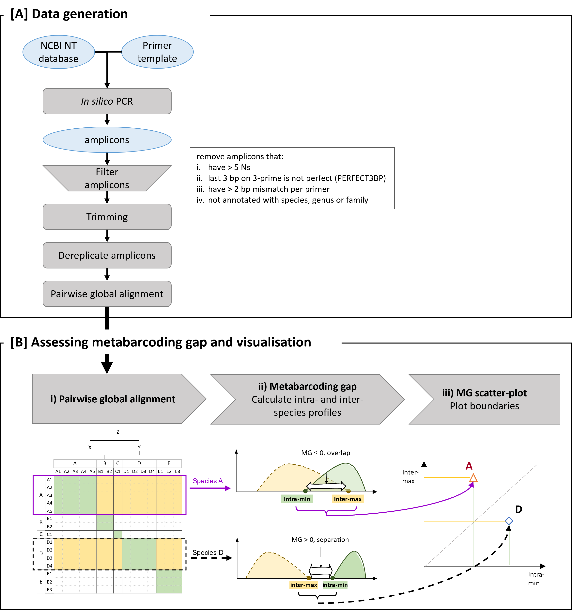

# Processing Pairwise alignments

The scripts in this section processes the pairwise alignments after data generation and prepares the data for the metabarcoding gap visualisation. This is Part B of the workflow schema below.




## Workflow

**Quick overview**

Briefly, the workflow consists of the following 8 steps. As pairwise alignments can generate extremely large data, the process leverages a map-and-reduce approach to allow for parallel processing. Steps 1 to 4 can be used in HPC environments that support job queues. The scripts can also be run on a local machine for small data sets (such as the demo data provided for the *teleo* primer pair) but is strongly recommended to move to HPC environments for processing of larger data. Step 5 combines the outputs into a single data table for visualisation in Step 6. Steps 7 and 8 provides deeper dive into the pairwise alignments from earlier steps.

1) Split the pairwise alignment input by line and then by queryID.
2) Merge spliced query files into groups based on taxonomy hierarchy.
3) Annotate the query and target sequences with taxonomy lineage and note down lowest common ancestor for each query/target sequence pair.
4) Aggregates the pairwise alignments by species; calculating the minimum and maximum similarity values for each query/target species pair.
5) Summarise the metabarcoding gap per species.
6) Generate the metabarcoding gap (MG) scatter plot (Figure XX in manuscript)
7) Generate histograms of the pairwise alignments (Figure XX in manuscript)
8) Generate heatmaps for a given query species (Figure XX in manuscript)

The scripts are prefixed with the running order.

**Starting input files**

* Single text file of global pairwise alignment file from VSEARCH/USEARCH based on the Blast like output. The {query} column should be the ID of the representative amplicon sequence (derepID).
* A metadata file that maps the derepID to the taxonomy lineage based on the 8 common ranks: superkingdom, kingdom, phylum, class, order, family, genus, and species

**Example data**

Example data is provided in the `example-data` folder which is the amplicons detected using the *teleo* primer pair using NCBI `nt` database (release 231, downloaded May 2019).

# Documentation

The following explains each of the scripts, describing the key inputs and outputs.

## 001_split_PWalign.R

This step expects text file(s) of pairwise alignments from VSEARCH/USEARCH and sorts them into files based on the {query} column. The query column should be the derepID, which is the representative amplicon sequence after dereplication.

Since pairwise alignments can generate extremely large data, this step prepares the data to leverage the map-and-reduce approach, allowing parallel processing under HPC environments.


### Input

The input is either 

* Single pairwise alignment text file from VSEARCH/USEARCH global pairwise alignment (`-allpairs_global`) output, following Blast like output. This is then split into parts of [L] lines for parallel processing
* Directory path with already spliced text files of pairwise alignments


### Example output

* Default output directory is `01-splitPWaln`
* Directory of sorted files where filenames follow the {query} ID

```
$ ls 01-splitPWaln/ | head
AB015962.1_q911_a99
AB016669.1_q590_a101
AB016671.1_q590_a101
AB016674.1_q590_a101
AB016676.1_q591_a101
AB016677.1_q591_a101
AB016678.1_q591_a101
AB016679.1_q591_a101
AB016680.1_q590_a100
AB016682.1_q590_a101
```

## 002_merge_taxa_groups.R

The step merges all query sequences together that belong to the same group. We used the taxonomy hierarchy for grouping which is specified in a metadata file (see below). 

This step adopts a map-and-reduce approach, allowing for running in parallel and HPC environments.

### Input

* The output directory (`01-splitPWaln`) from Step 1
* Metadata file (figure below) that maps each queryID to a taxonomy hierarchy formatted as a file path. 
  * The demo metadata file provided follows the taxonomy hierarchy but as species aren't uniformly distributed across lineage, with some clades having >100 or >1000 species and other clades having only one or two species, the groups have been generated to try to have balanced numbers. As such the output will sometimes split a group into subgroup-1, subgroup-2, ..., subgroup-N. See example output shown below.
  * Note that the {group} column uses the file directory formatting which is used for organising the output files.


### Example output

* Default output directory is `02-taxaGroups`
* The output directory follows the given {group} column formatted as a file path
* Some groups will be split into subgroups due to uneven distribution of species

```
02-taxaGroups
└───Eukaryota
    └───Metazoa
        └───Chordata
            │   Chordata-subgroup-1.rds
            │
            └───Actinopteri
                │   Actinopteri-subgroup-1.rds
                │   Actinopteri-subgroup-2.rds
                │   Actinopteri-subgroup-3.rds
                │   Actinopteri-subgroup-4.rds
                │   Actinopteri-subgroup-5.rds
                │   Actinopteri-subgroup-6.rds
                │   Actinopteri-subgroup-7.rds
                │   Actinopteri-subgroup-8.rds
                │
                ├───Cypriniformes
                │       Cypriniformes-subgroup-1.rds
                │       Cypriniformes-subgroup-2.rds
                │       Cypriniformes-subgroup-3.rds
                │
                └───Siluriformes
                        Siluriformes-subgroup-1.rds
                        Siluriformes-subgroup-2.rds
```

## 003_annotate_PWalign.R

This step annotates the {query} and {target} sequence for each pairwise alignment with the taxonomy information e.g., species name, their lowest common taxonomy rank etc (see below).

This step adopts a map-and-reduce approach, allowing for running in parallel and HPC environments.

**Note:** this step can be time consuming when running on a local machine even with the example *teleo* data set.

### Input

* The output directory (`02-taxaGroups`) from Step 2
* Metadata file that maps the sequenceID to a taxonomy lineage (see example figure shown above in Step 2.)

### Example output

* Default output directory is `03-taxaAnnot`
* Output is a Rdata object (*.rds) data.table of 9 columns as shown below
  * The table is still a pairwise alignment table of queries-target pairs, but has been annotated by the species.name of the query and target sequenced. Only the similarity column (`pident`) and coverage columns are retained in this table.
  * The last three column specifies:
    * `same.rank` - the lowest common taxonomy rank to which both query and target pair belongs.
    * `same.taxa` - the name of this same rank
    * `query.variant.type` - whether the query species only has a single amplicon variant or has multi(ple) amplicon variants. If there is only a single variant, then this means that the minimum intra-species similarity would be 100% (used in Step 4)

```
                   query    query.species               target            target.species pident  coverage same.rank     same.taxa query.variant.type
1: AB979696.1_q1014_a100 Amphiprion sebae JQ030887.1_q904_a101      Amphiprion bicinctus   96.9 0.6237624     genus    Amphiprion              multi
2: AB979696.1_q1014_a100 Amphiprion sebae  FJ616294.1_q835_a99 Abudefduf septemfasciatus   90.5 0.6200000    family Pomacentridae              multi
3: AB979696.1_q1014_a100 Amphiprion sebae NC_041192.1_q902_a99     Abudefduf bengalensis   88.9 0.6200000    family Pomacentridae              multi
4: AB979696.1_q1014_a100 Amphiprion sebae  JN935319.1_q414_a99    Halichoeres marginatus   85.7 0.6200000     class   Actinopteri              multi
5: AB979696.1_q1014_a100 Amphiprion sebae  DQ164144.1_q417_a98  Halichoeres leucoxanthus   85.7 0.6200000     class   Actinopteri              multi
6: AB979696.1_q1014_a100 Amphiprion sebae  FJ616296.1_q835_a99        Abudefduf sordidus   85.7 0.6200000    family Pomacentridae              multi
```


## 004_calc_MGboundary.R

Aggregates the pairwise alignments by species and calculates the minimum and maximum similarity for each pair of query and target species.

This step adopts a map-and-reduce approach, allowing for running in parallel and HPC environments.

### Input

* The output directory (`03-taxaAnnot`) from Step 3

### Example output

* Output is a Rdata object (*.rds) data.table of 10 columns as shown below
* This table contains the minimum and maximum similarity value for the intra-rank and inter-rank distribution.
  * For each species, there will be a separate row for every inter-rank pair. That is, the closest species from the next higher taxonomic rank. For example, there are 4 rows for the *Amphiprion sebae* species of inter-ranks: genus, family, class and phylum. There is no {order} row because there were no species of the same order as *Amphiprion sebae* in this data set that consists of amplicons targeted by the *teleo* primer pair.

```
       query.species intra.minP intra.maxP intra.nPairs inter.rank       inter.taxa inter.minP inter.maxP inter.nPairs nTargetSpecies
              <char>      <num>      <num>        <int>      <ord>           <char>      <num>      <num>        <int>          <int>
1:  Amphiprion sebae       93.8       93.8            2      genus       Amphiprion       87.3      100.0           28             11
2:  Amphiprion sebae       93.8       93.8            2     family    Pomacentridae       57.8       90.5          152             70
3:  Amphiprion sebae       93.8       93.8            2      class      Actinopteri       48.4       87.5         9380           3952
4:  Amphiprion sebae       93.8       93.8            2     phylum         Chordata       44.4       73.4          746            307
5: Polyodon spathula       96.7       96.7            2      order Acipenseriformes       85.2       95.1           74             30
6: Polyodon spathula       96.7       96.7            2     phylum         Chordata       47.5       77.8          746            307
```

## 005_summarise_MGboundary.R

After Steps 1 and 4 have been processed for *all* data, this script then summarise the information into a single table. For every species, there is only one row in output with the minimum intra-species similarity and the maximum inter-species similarity. The output is used as input for metabarcoding gap scatter plot visualisation.

### Input

* The output directory (`04-MGboundaries`) from Step 4.

### Output

* One Rdata object (*.rds) data.table (also saved as text format *.tsv file)


## 006_MG_scatterplot.R

This script generates an example of the metabarcoding gap (MG) scatterplot.


## 007_MG_histogram.R

This script generates an example of the metabarcoding gap (MG) histogram for one query species.


## 008_MG_heatmap.R

This script generates an example of a metabarcoding gap (MG) heatmap of a subset of pairwise alignments for a query species.