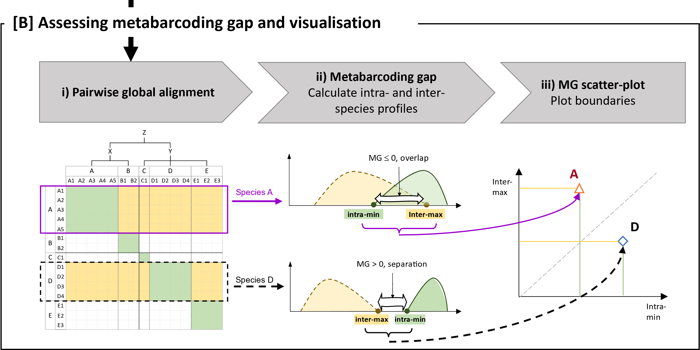
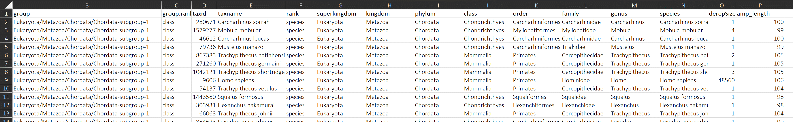

# Processing Pairwise alignments

The scripts in this section processes the pairwise alignments after data generation and prepares the data for the metabarcoding gap visualisation. This is Part B of the workflow schema below.




## Workflow overview

Briefly, the workflow consists of the following 5 steps. As pairwise alignments can generate extremely large data, the process leverages a map-and-reduce approach to allow for parallel processing. Steps 1 to 4 can be used in HPC environments that support job queues and Step 5 combines the outputs into a single data table for visualisation. 

The scripts can be run on a local machine for small data sets (such as the demo data provided for the *teleo* primer pair) but it is strongly recommended to move to HPC environments for processing of larger data. 

1) Split the pairwise alignment input by line and then by queryID.
2) Merge spliced query files into groups based on taxonomy hierarchy.
3) Annotate the query and target sequences with taxonomy lineage and note down lowest common ancestor for each query/target sequence pair.
4) Aggregates the pairwise alignments by species; calculating the minimum and maximum similarity values for each query/target species pair.
5) Summarise the metabarcoding gap per species.


Scripts for the data processing workflow are prefixed with the running order. They can also be run from the command line using `Rscript`.


## Visualisation scripts

The other three scripts provide examples of visualisations described in the manuscript:

Example 1) MG-scatterplot: generates the metabarcoding gap (MG) scatter plot of the amplicons targeted by a *single* primer pair

Given a species of interest, deeper investigation is provided by:

Example 2) MG-histogram: generates the histogram of pairwise alignments for sequences belonging to the species of interest. The histogram is further segregated by taxonomy ranks.
Example 3) MG-heatmap: generates subset heatmap showing the pairwise alignments for the species of interest.


Visualisation scripts can only be run within `R` (or RStudio) as paths to input files are hard coded.


## Example data

Example data is provided in the `example-data` folder which is the *in silico* PCR amplicons detected using the *teleo* primer pair using NCBI `nt` database (release 231, downloaded May 2019). Example of processed data after Steps 3 and 5 are generated for the example visualisation scripts. Other intermediate files can be generated by the provided R scripts.


# Requirements

The R scripts require the following packages:

```
install.packages(c('argpaser',
                   'cowplot',
                   'data.table',
                   'doParallel',
                   'forcats',
                   'futile.logger',
                   'ggplot2',
                   'ggrepel',
                   'parallel'
))
```


# Documentation: data processing

The following subsections explains each of the scripts, describing the key inputs and example outputs. Steps 1 to 5 can be run from the command line, you can find the list of accepted parameters using:

```
Rscript <script_name.R> --help
```

The example visualisation scripts are to be run from within `R` (or RStudio).


## STEP 1) 001_split_PWalign.R

This step expects text file(s) of sequence pairwise alignments from VSEARCH/USEARCH and sorts them into files based on the {query} column. The query column should be the derepID, which is the representative amplicon sequence after dereplication. Each sequence belongs to one species and one species can have multiple reference sequences. A sequence is aligned against all other sequences in the data set. As such there are $N \times N-1$ possible alignments. 

Since pairwise alignments can generate extremely large data, this step prepares the data to leverage the map-and-reduce approach, allowing parallel processing under HPC environments.

**Note: Requirement for full pairwise alignment**:
> Usually with pairwise alignments being symmetrical such that the value for $(i,j) == (j,i)$ we would only need to keep either the upper or lower triangle of a pairwise matrix, that is, only retain (i,j). This is the usual default behaviour from pairwise alignments like VSEARCH/USEARCH which only provides matches for one direction. However, one usage of this data is to allow a user to query the data to focus on a (or a set of) species of interests, and extract all sequences belonging to that set. This means only extracting rows from the pairwise matrix of sequences belonging to the species of interest. If we only retained half the matrix, then there would be missing values when sub-setting by rows. As such, during step 1 we perform the reciprocal alignments when sorting the input.


### Input

The input is either 

* Single pairwise alignment text file from VSEARCH/USEARCH global pairwise alignment (`-allpairs_global`) output, following Blast like output. This is then split into parts of [L] lines for parallel processing
* Directory path with already spliced text files of pairwise alignments

### Example usage

```
Rscript 001_split_PWalign.R example-data/00_parts --skip-by-lines
```

### Example output

* Default output directory is `01-splitPWaln`
* Directory of sorted files where filenames follow the {query} ID

```
$ ls 01-splitPWaln/ | head
AB015962.1_q911_a99
AB016669.1_q590_a101
AB016671.1_q590_a101
AB016674.1_q590_a101
AB016676.1_q591_a101
AB016677.1_q591_a101
AB016678.1_q591_a101
AB016679.1_q591_a101
AB016680.1_q590_a100
AB016682.1_q590_a101
```

## STEP 2) 002_merge_taxa_groups.R

The step merges all query sequences together that belong to the same species (or user defined group). We used the taxonomy hierarchy structure for grouping, and the mapping of a sequence ID to a group is specified in a metadata file (image below).

This step adopts a map-and-reduce approach, allowing for running in parallel and HPC environments.

### Input

* The output directory (`01-splitPWaln`) from Step 1
* Metadata file (figure below) that maps each queryID to a taxonomy hierarchy formatted as a file path. 
  * The demo metadata file provided follows the taxonomy hierarchy but as species aren't uniformly distributed across lineage, with some clades having >100 or >1000 species and other clades having only one or two species, the groups have been generated to try to have balanced numbers. As such the output will sometimes split a group into subgroup-1, subgroup-2, ..., subgroup-N. See example output shown below.
  * Note that the {group} column uses the file directory formatting which is used for organising the output files.



### Example usage

```
Rscript 002_merge_taxa_groups.R 01-splitPWlan example-data/nt.201905__teleo__taxaMetadata.tsv
```

### Example output

* Default output directory is `02-taxaGroups`
* The output directory follows the given {group} column formatted as a file path
* Some groups will be split into subgroups due to uneven distribution of species

```
02-taxaGroups
└───Eukaryota
    └───Metazoa
        └───Chordata
            │   Chordata-subgroup-1.rds
            │
            └───Actinopteri
                │   Actinopteri-subgroup-1.rds
                │   Actinopteri-subgroup-2.rds
                │   Actinopteri-subgroup-3.rds
                │   Actinopteri-subgroup-4.rds
                │   Actinopteri-subgroup-5.rds
                │   Actinopteri-subgroup-6.rds
                │   Actinopteri-subgroup-7.rds
                │   Actinopteri-subgroup-8.rds
                │
                ├───Cypriniformes
                │       Cypriniformes-subgroup-1.rds
                │       Cypriniformes-subgroup-2.rds
                │       Cypriniformes-subgroup-3.rds
                │
                └───Siluriformes
                        Siluriformes-subgroup-1.rds
                        Siluriformes-subgroup-2.rds
```

## STEP 3) 003_annotate_PWalign.R

This step annotates the {query} and {target} sequence for each pairwise alignment with their taxonomy information e.g., species name. It also notes down the lowest common taxonomy rank for a each query/target pair (see example output below).

This step adopts a map-and-reduce approach, allowing for running in parallel and HPC environments.

**Note:** this step can be time consuming when running on a local machine even with the example *teleo* data set.

### Input

* The output directory (`02-taxaGroups`) from Step 2
* Metadata file that maps the sequenceID to a taxonomy lineage (see example figure shown above in Step 2.)

### Example usage

```
Rscript 003_annotate_PWalign.R 02-taxaGroups example-data/nt.201905__teleo__taxaMetadata.tsv --annot-type all
```

### Example output

* Default output directory is `03-taxaAnnot`
* Output is a Rdata object (*.rds) data.table of 9 columns as shown below
  * The table is still a pairwise alignment table of queries-target pairs, but has been annotated by the species.name of the query and target sequenced. Only the similarity column (`pident`) and coverage columns are retained in this table.
  * The last three column specifies:
    * `same.rank` - the lowest common taxonomy rank to which both query and target pair belongs.
    * `same.taxa` - the name of this same rank
    * `query.variant.type` - whether the query species only has a single amplicon variant or has multi(ple) amplicon variants. If there is only a single variant, then this means that the minimum intra-species similarity would be 100% (used in Step 4)

```
                   query    query.species               target            target.species pident  coverage same.rank     same.taxa query.variant.type
1: AB979696.1_q1014_a100 Amphiprion sebae JQ030887.1_q904_a101      Amphiprion bicinctus   96.9 0.6237624     genus    Amphiprion              multi
2: AB979696.1_q1014_a100 Amphiprion sebae  FJ616294.1_q835_a99 Abudefduf septemfasciatus   90.5 0.6200000    family Pomacentridae              multi
3: AB979696.1_q1014_a100 Amphiprion sebae NC_041192.1_q902_a99     Abudefduf bengalensis   88.9 0.6200000    family Pomacentridae              multi
4: AB979696.1_q1014_a100 Amphiprion sebae  JN935319.1_q414_a99    Halichoeres marginatus   85.7 0.6200000     class   Actinopteri              multi
5: AB979696.1_q1014_a100 Amphiprion sebae  DQ164144.1_q417_a98  Halichoeres leucoxanthus   85.7 0.6200000     class   Actinopteri              multi
6: AB979696.1_q1014_a100 Amphiprion sebae  FJ616296.1_q835_a99        Abudefduf sordidus   85.7 0.6200000    family Pomacentridae              multi
```


## STEP 4) 004_calc_MGboundary.R

We then aggregate all the pairwise alignments by species and calculate the minimum and maximum similarity for each pair of query and target species. The output after this step is reduced as there is only one row per query.species and it's next closest match of each taxonomic rank (see example output below).

This step adopts a map-and-reduce approach, allowing for running in parallel and HPC environments.

### Input

* The output directory (`03-taxaAnnot`) from Step 3

### Example usage

```
Rscript 004_calc_MGboundary.R 03-taxaAnnot
```

### Example output

* Output is a Rdata object (*.rds) data.table of 11 columns as shown below
* This table contains the minimum and maximum similarity value for the intra-rank and inter-rank distribution.
  * For each species, there will be a separate row for every inter-rank pair. That is, the closest species from the next higher taxonomic rank. For example, there are 4 rows for the *Amphiprion sebae* species of inter-ranks: genus, family, class and phylum. There is no {order} row because there were no species of the same order as *Amphiprion sebae* in this data set that consists of amplicons targeted by the *teleo* primer pair.

```
             query.species query.variant.type intra.minP intra.maxP intra.nPairs inter.rank       inter.taxa inter.minP inter.maxP inter.nPairs nTargetSpecies
1: Acipenser transmontanus             single        100        100            1      class      Actinopteri       47.7       81.0         4742           4002
2: Acipenser transmontanus             single        100        100            1     phylum         Chordata       49.2       73.8          373            307
3: Acipenser transmontanus             single        100        100            1     family    Acipenseridae       91.8      100.0           12             10
4: Acipenser transmontanus             single        100        100            1      genus        Acipenser       91.8      100.0           24             19
5: Acipenser transmontanus             single        100        100            1      order Acipenseriformes       86.9       91.8            3              2
6:              Amia calva             single        100        100            1      class      Actinopteri       48.6       77.4         4781           4033
```

## STEP 5) 005_summarise_MGboundary.R

After Steps 1 to 4 have been processed for *all* data, this script then summarise the information into a single table. For every species, there is only one row in the output table, with:

  * min/max similarity value for sequences from the same species (intra-species) and * min/max similarity value for sequences from the next closest species (inter-species), and
  * other metadata related the taxonomy lineage and information for the inter-species

The output is used as input for metabarcoding gap scatter plot visualisation.

### Input

* The output directory (`04-MGboundaries`) from Step 4.

### Example usage

```
Rscript 005_summarise_MGboundary.R 04-MGboundaries 03-taxaAnnot/metadata-variant-type.rds
```

### Example output

* One Rdata object (*.rds) data.table 
* One tab-separated text file (*.tsv) of the same table
* An example of the final output table is in `example-data/teleo_MGboundary.tsv`

```
Classes ‘data.table’ and 'data.frame':	4341 obs. of  24 variables:
 $ query.superkingdom  : chr  "Eukaryota" "Eukaryota" "Eukaryota" "Eukaryota" ...
 $ query.kingdom       : chr  "Metazoa" "Metazoa" "Metazoa" "Metazoa" ...
 $ query.phylum        : chr  "Chordata" "Chordata" "Chordata" "Chordata" ...
 $ query.class         : chr  "Actinopteri" "Actinopteri" "Actinopteri" "Actinopteri" ...
 $ query.order         : chr  "Acipenseriformes" "Amiiformes" "Albuliformes" "" ...
 $ query.family        : chr  "Acipenseridae" "Amiidae" "Albulidae" "Pomacentridae" ...
 $ query.genus         : chr  "Acipenser" "Amia" "Pterothrissus" "Abudefduf" ...
 $ query.species       : chr  "Acipenser transmontanus" "Amia calva" "Pterothrissus gissu" "Abudefduf vaigiensis" ...
 $ query.group         : chr  "Eukaryota/Metazoa/Chordata/Actinopteri/Actinopteri-subgroup-1" "Eukaryota/Metazoa/Chordata/Actinopteri/Actinopteri-subgroup-1" "Eukaryota/Metazoa/Chordata/Actinopteri/Actinopteri-subgroup-1" "Eukaryota/Metazoa/Chordata/Acti"..
 $ query.group.rank    : chr  "order" "order" "order" "order" ...
 $ nVariants           : int  1 1 1 1 1 1 1 1 1 2 ...
 $ variant.type        : chr  "single" "single" "single" "single" ...
 $ query.variant.type  : Factor w/ 2 levels "multi","single": 2 2 2 2 2 2 2 2 2 1 ...
 $ intra.minP          : num  100 100 100 100 100 100 100 100 100 93.8 ...
 $ intra.maxP          : num  100 100 100 100 100 100 100 100 100 93.8 ...
 $ intra.nPairs        : num  1 1 1 1 1 1 1 1 1 2 ...
 $ inter.rank          : Ord.factor w/ 8 levels "superkingdom"<..: 6 3 3 7 4 7 7 7 7 7 ...
 $ inter.taxa          : chr  "Acipenseridae" "Chordata" "Chordata" "Abudefduf" ...
 $ inter.minP          : num  91.8 50 42.9 79 47.9 89.1 87.3 85.9 89.1 87.3 ...
 $ inter.maxP          : num  100 77.8 77.8 100 84.1 100 96.8 92.1 100 100 ...
 $ inter.nPairs        : int  12 373 373 11 4605 15 15 15 15 28 ...
 $ nTargetSpecies      : int  10 307 307 9 3901 11 11 11 11 11 ...
 $ closest.interspecies: num  100 77.8 77.8 100 84.1 100 96.8 92.1 100 100 ...
 $ MG.type             : Factor w/ 3 levels "overlap","on",..: 2 3 3 2 3 2 3 3 2 1 ...
```


# Documentation: visualisation

Three example scripts are provided that generates the three types of figures described in the manuscript. These scripts are designed to be run within `R` (or RStudio).


## example-01__MG-scatterplot.R

This script generates an example of the metabarcoding gap (MG) scatterplot of the *teleo* amplicon data set after Step 5 of the data processing workflow described above.


## example-02__MG-histogram.R

This script generates an example of the MG Histogram for a given species of interest. All pairwise alignments of sequences belonging to this species are shown in the histogram which is further segragated by the taxonomy rank of the lowest taxonomy rank. This clearly demonstrates the rank of the next closest relative to the given species of interest.


## example-03__MG-heatmap.R

This script generates an example of a MG Heatmap for a given species of interest. As the number of pairwise alignments can be very big, the heatmap only shows the top most similar alignments to the species of interest to reduce the size of the figure.


Other examples of figures can be found in the 'manuscript-figures' folder.